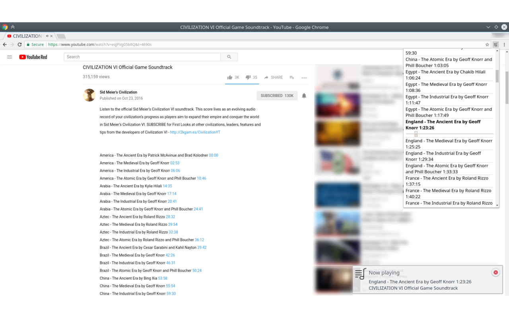

# Youtube Timestamps to Playlist

Chrome extension which creates a playlist from time tags on a YouTube page

When viewing a video on YouTube containing multiple songs, this extension looks
for a list of "time tags", for example "0:40 Symphony No. 5 in C Minor",
and builds a playlist. You can open the playlist with one click, and easily
change to a different song or seek within the song. It also displays a
notification when a new song starts playing.

## Install

For the stable release, install from the [Chrome Web Store](https://chrome.google.com/webstore/detail/youtube-timestamps-to-pla/jmjgdfollcmomdjljhjkcenehcgbiogm)

To test the latest changes, turn on Developer Mode in the Chrome extensions page,
selecte Load Unpacked, and select the directory containing these files.
